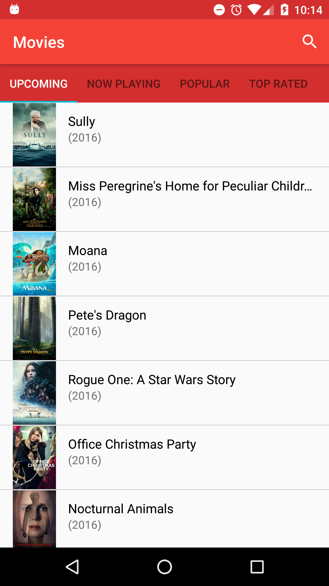

# Popular-movies
Project: Android application to explore popular, recent and top movies.

Created using [The Movie Database API.](https://www.themoviedb.org/?language=en)

**Full video preview** http://youtu.be/W7lWzTbGAXs

## Features
The following **required** functionality is completed
- [x] User can view popular, now playing, recent and top rated movies.
- [x] All images load asynchronously
- [x] User sees loading state while waiting for the data from API.
- [x] User can endlessly scroll movie list for continuous data display.
- [x] User can view cast members' details and information.
- [x] User can explore related movies designed into cardviews.
- [x] Material design support with floating action button for additional features such as viewing trailers.   
- [x] Error message displayed when user is encouters network error.
- [x] Search functionality (Coming soon...)

## Screenshots

 Detailed Movie View                                                             |  Movies Main Page ViewPager
:-------------------------------------------------------------------------------:|:--------------------------------------------------------------------------------:
 |  


Related Movies CardView                                                          |  Cast ViewPager
:-------------------------------------------------------------------------------:|:--------------------------------------------------------------------------------:
 |  

## Video Preview
 

## Libraries Used

###View Binding
[ButterKnife](https://jakewharton.github.io/butterknife/)

###API Requests
[Retrofit](https://square.github.io/retrofit/)

###Image Loading
[Picasso](https://square.github.io/picasso/)


## License
```
Copyright [2016] [Victor Akap Oben]

Licensed under the Apache License, Version 2.0 (the "License");
you may not use this file except in compliance with the License.
You may obtain a copy of the License at

    http://www.apache.org/licenses/LICENSE-2.0

Unless required by applicable law or agreed to in writing, software
distributed under the License is distributed on an "AS IS" BASIS,
WITHOUT WARRANTIES OR CONDITIONS OF ANY KIND, either express or implied.
See the License for the specific language governing permissions and
limitations under the License.
```
